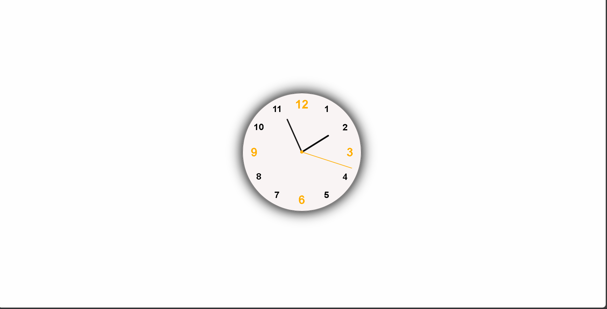

# Analog Clock ⏰

An interactive analog clock built using HTML, CSS, and JavaScript.  
It displays the current time with moving hour, minute, and second hands.

---

## 🎯 Features

- Real-time clock updates.
- Smooth rotation animations for hands.
- Responsive design.

---

## 🛠 Tech Stack

- HTML5
- CSS3 (for styling and animations)
- JavaScript (for time calculations and DOM updates)

---

## 🚀 How to Run

1. Open `index.html` in your browser.
2. The clock will automatically start and update in real-time.

---

## 📷 Preview

---

## 📚 Concepts Practiced

- DOM Manipulation
- `setInterval()` for real-time updates
- CSS `transform` for rotations
