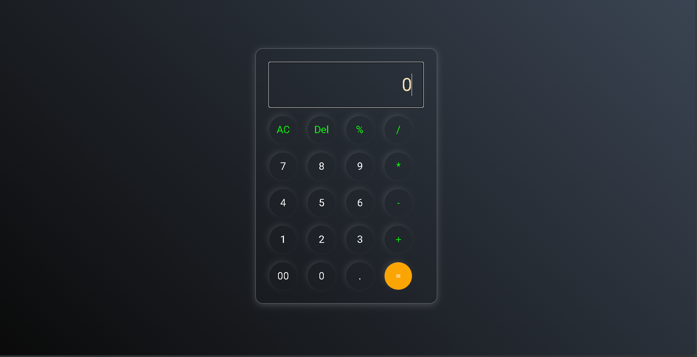

# 🧮 Calculator

A simple and responsive calculator built using HTML, CSS, and JavaScript.  
It supports basic arithmetic operations like addition, subtraction, multiplication, and division.

---

## 🎯 Features

- Perform basic math operations.
- Clear and delete buttons for easy corrections.
- Responsive design for desktop and mobile.
- User-friendly interface.

---

## 🛠 Tech Stack

- **HTML5** – Structure
- **CSS3** – Styling and responsiveness
- **JavaScript** – Logic and interactivity

---

## 🚀 How to Run

1. Clone or download this repository.
2. Open `index.html` in your browser.
3. Start calculating!

---

## 📷 Preview

---

## 📚 Concepts Practiced

- DOM Manipulation
- Event Handling
- JavaScript Functions
- CSS Flexbox/Grid for layout
