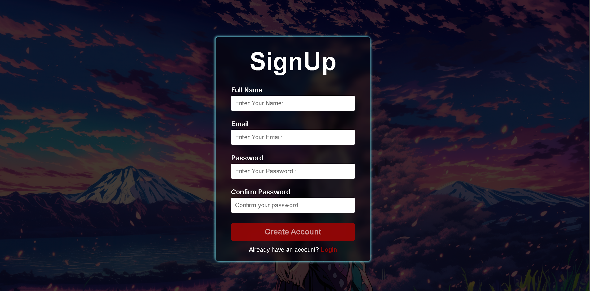

# Signup / Login Form Validation 🔐

A stylish and fully functional signup/login form built with **HTML**, **CSS**, and **JavaScript**.  
It validates user inputs such as name, email, and password before allowing form submission.

---

## 🎯 Features

- Real-time form validation.
- Stylish glassmorphism-inspired UI.
- Password confirmation check.
- Email format validation.
- Prevents form submission until all fields are valid.
- Responsive and mobile-friendly design.

---

## 🛠 Tech Stack

- **HTML5** – Structure of the form.
- **CSS3** – Glassmorphism styling & responsive layout.
- **JavaScript** – Input validation logic.

---

## 🚀 How to Run

1. Download or clone this repository.
2. Open `index.html` in your browser.
3. Fill out the form and test the validation.

---

## 📷 Preview

---

## 📚 Concepts Practiced

- DOM Manipulation
- Regular Expression (`RegExp`) for email & password validation
- Event Handling (`input`, `submit`)
- Form error handling and feedback
