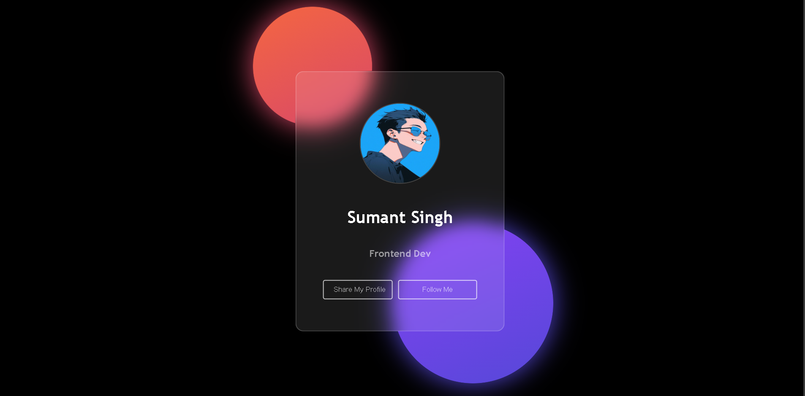

# 🌐 Share Profile Card

A stylish and modern **Profile Card** built with **HTML, CSS, and JavaScript**.  
This project showcases a personal profile card with smooth UI, glowing effects, and interactive buttons.

---

## 🚀 Features

- Clean and modern glassmorphism design
- Glowing background circles for a stylish effect
- Responsive card with profile image, name, and title
- Buttons to **Share Profile** and **Follow Me**

---

## 🛠️ Tech Stack

- **HTML5** – Structure
- **CSS3** – Styling, Glassmorphism, Animations
- **JavaScript** – Interactivity

---

## 📸 Screenshot

---

## 💻 Usage

1. Open `index.html` in your browser
2. View your profile card
3. Use the buttons to share or link your profile
