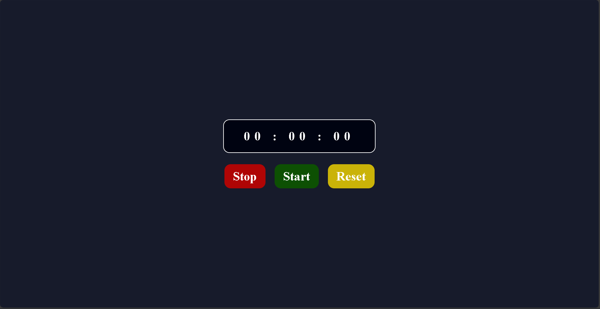

# ⏱️ Stopwatch Project

A simple and clean stopwatch built using **HTML, CSS, and JavaScript**.  
It lets you **Start, Stop, and Reset** time with an easy-to-use interface.

---

## 🚀 Features

- Start the stopwatch to begin counting time
- Stop it anytime to pause
- Reset back to `00:00:00`
- Clean and minimal dark UI
- Color-coded buttons for better usability

---

## 🛠️ Tech Stack

- **HTML** – Structure of the stopwatch
- **CSS** – Styling (dark mode + colorful buttons)
- **JavaScript** – Functionality (time counting logic)

---

## 📸 Preview

