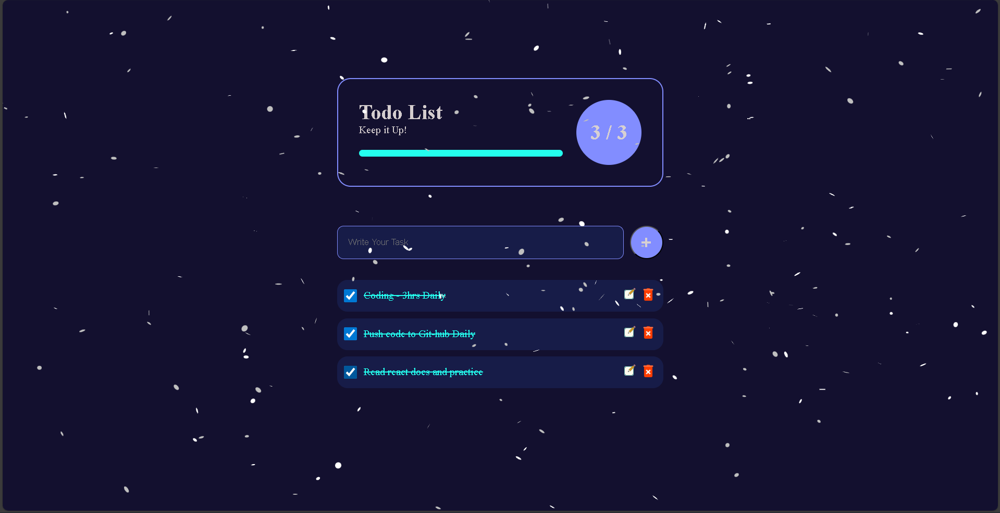

# ❄️ Todo List – Simple, Clean & Rewarding

Hey there! This is a fun little **Todo List app** I built using **HTML, CSS, and JavaScript**. It’s super simple to use, saves your tasks in the browser, and even throws a smooth snowfall animation when you complete everything — just a little reward for staying productive 😄

## 🔧 What It Does

- Add tasks, check them off, or delete them anytime
- Your list is saved in **local storage**, so it sticks even after refreshing
- Shows progress like `3/3` completed
- When all tasks are done, a **snow animation** pops up to celebrate 🎉
- Clean UI with a dark theme and smooth transitions

## 🧪 Tech Used

- HTML for structure
- CSS for styling
- JavaScript for logic and local storage

## 🖼️ Screenshot

Here’s how it looks when all tasks are done:


## 🚀 How to Run

Just clone the repo and open `index.html` in your browser:

```bash
git clone https://github.com/SumantKrSingh/Todo_List.git

```
